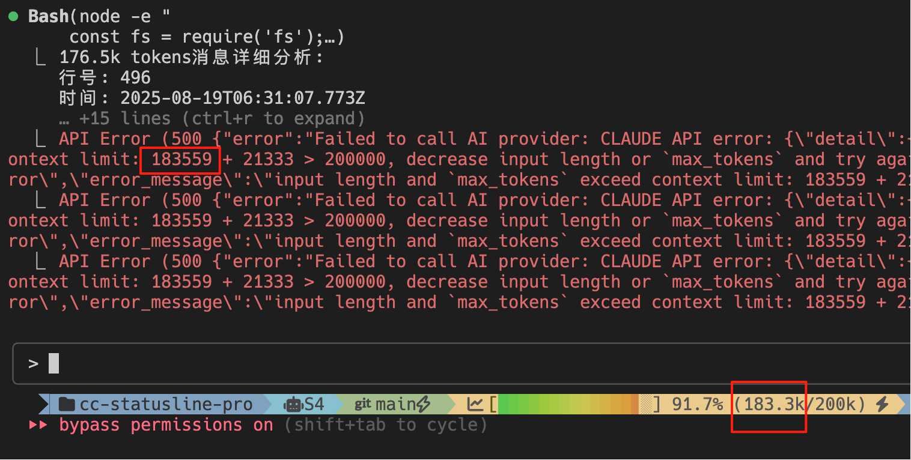

# Claude Code Statusline Pro

[](https://badge.fury.io/js/claude-code-statusline-pro)
[](https://opensource.org/licenses/MIT)
[](https://nodejs.org/)
[](https://github.com/wangnov/claude-code-statusline-pro)

[中文](#使用指南) | [English](#user-guide)

---

# 使用指南

**Claude Code 专业状态栏** - 为Claude Code量身定制的智能状态栏系统。

## ✨ 核心特性

- 🎯 **三大主题系统**: Classic、Powerline、Capsule 主题，自适应终端能力
- 🛠️ **交互式配置编辑器**: 全屏可视化配置界面，支持实时预览和分类管理
- 📊 **精准Token计算**: 与Claude官方API完全一致的token统计，支持渐变可视化进度条
- 🧠 **智能状态识别**: 基于tokens数量精准识别Thinking vs Ready状态
- 🚀 **预设系统**: 通过字母组合快速配置组件排布 (`PMBTUS`, `MT`, `BT`)
- 🌈 **跨平台兼容**: Windows、macOS、Linux智能适配，支持各种终端
- ⚡ **高性能优化**: 缓存机制，300ms更新间隔，符合Claude Code官方建议
- 🌐 **双语支持**: 中英双语配置界面和错误提示

## 📋 系统要求

在开始使用之前，请确保您的系统满足以下要求：

### 必需条件
- **Claude Code**: 版本 ≥ 1.0.71
- **Node.js**: 版本 ≥ 18.0.0 ([下载安装](https://nodejs.org/))
- **npm**: 通常随Node.js自动安装

### 检查当前版本
```bash
# 检查Claude Code版本
claude --version

# 检查Node.js版本
node --version

# 检查npm版本
npm --version
```

## 🚀 快速开始

### 一步配置，即刻使用

只需要在Claude Code的配置文件中添加一行配置，无需预先安装：

**在项目根目录或家目录创建 `.claude/settings.json`：**

```json
{
  "statusLine": {
    "type": "command", 
    "command": "npx claude-code-statusline-pro@latest"
  }
}
```

保存文件后，重新打开Claude Code即可看到专业版状态栏！

### 验证安装

打开Claude Code，你应该看到类似这样的状态栏：

```
📁 my-project | 🤖 S4 | 🌿 main | 📊 [████████████░░░] 80.1%(160k/200k) | $21.07 | ✅ Ready
```

## 🎯 快速配置指南

### 预设系统 - 字母组合配置

通过简单的字母组合快速定制状态栏显示内容：

- **P** = Project (项目名称)  
- **M** = Model (模型信息)
- **B** = Branch (Git分支)
- **T** = Tokens (Token使用情况)
- **U** = Usage (使用量统计) 
- **S** = Status (状态信息)

### 快速配置命令

注：这些命令全部是写在settings.json中的，并不是在终端直接执行使用（直接执行会打印出预览结果）
```bash
# 显示所有组件（推荐）
npx claude-code-statusline-pro@latest --preset PMBTUS --theme powerline

# 只显示模型、Token和使用量
npx claude-code-statusline-pro@latest --preset MTU --theme classic

# 只显示分支和Token信息
npx claude-code-statusline-pro@latest --preset BT --theme capsule
```

## 🎨 三大主题系统

### Classic 主题 - 最大兼容性

Classic主题支持三种图标模式，默认会根据终端能力自动选择：

#### 🎯 Nerd Font 模式（推荐）


**需要安装Nerd Font字体，并在对应的终端中选择使用字体**，推荐使用 [Hack Nerd Font](https://github.com/ryanoasis/nerd-fonts/releases/download/v3.2.1/Hack.zip)

#### 😊 Emoji 模式


适合支持Emoji但没有Nerd Font的终端

#### 📝 文本模式


最大兼容性，适合所有终端环境

### Powerline主题 - 现代化设计（需要Nerd Font字体）


箭头无缝连接设计，需要Nerd Font支持，提供最佳视觉体验。

### Capsule主题 - 胶囊样式（需要Nerd Font字体）


胶囊形状包装，现代化UI设计，适合追求简洁美观的用户。

### 强制启用特定模式

如果你的终端本就支持某种图标（例如Nerd Font），但没有自动启用，则可强制指定启用该图标能力

```bash
# 强制启用Nerd Font图标（需要安装字体，否则会显示乱码）
npx claude-code-statusline-pro@latest --force-nerd-font

# 强制启用Emoji图标（需要终端确实支持Emoji，如MacOS，否则会显示乱码）
npx claude-code-statusline-pro@latest --force-emoji  

# 强制启用纯文本模式
npx claude-code-statusline-pro@latest --force-text
```

## 📊 Token计算准确性

### 与Claude官方API完全一致

状态栏的token计算与Claude官方API保持完全一致，确保显示数据的准确性：



**如图所示**：
- 状态栏显示：`183.3k/200k (91.7%)`
- Claude API报错：`183559 + 21333 > 200000`
- 计算结果：`183559 ≈ 183.3k` ✅ 完全一致

### Token计算公式

```javascript
contextUsedTokens = usage.input_tokens + 
                   usage.cache_creation_input_tokens + 
                   usage.cache_read_input_tokens + 
                   usage.output_tokens;
```

这确保了状态栏显示的token使用量与Claude官方统计完全一致。

## 💰 Cost计算说明

### 会话总消耗计算

cost的消耗计算分两个模式，一个是session，一个是conversation。可以在config.toml中配置。

session模式的逻辑就是你打开CLAUDE Code，在没有/clear的情况下，开了多长时间产生了多少消耗。

conversation模式的逻辑是：

状态栏中的cost显示的是**当前对话的总消耗**，计算逻辑如下：

- **计算范围**: 整个Claude Code对话从开始到当前的累计消耗，而非会话。它会计算这个对话的整个生命周期，例如关闭了ClaudeCode再恢复它，它的session-id会发生变化。我们会跨session-id追踪它。
- **时间无关**: 不考虑时间因素，只计算token使用量
- **与/cost命令不同**: `/cost`命令可能有不同的计算逻辑和时间范围

## 🛠️ 高级配置

### TOML配置文件

在你的项目下，运行 ```npx claude-code-statusline-pro@latest config --init```来初始化一个配置文件

会在你的 ~/.claude/projects/{project-path-name}/statusline-pro/config.toml 这是项目级配置文件

如果添加```-g```参数则会初始化到 ~/.claude/statusline-pro/config.toml 这是用户级配置文件（全局）

项目级>配置级

在 `config.toml` 中进行详细配置：

```toml
# 默认预设和主题
preset = "PMBTUS"
theme = "powerline"

# 主题特性配置
[themes.powerline]
enable_gradient = true
ignore_separator = true
fine_progress = true

# 组件顺序配置
[components]
order = ["project", "model", "branch", "tokens", "usage", "status"]

# Token组件详细配置
[components.tokens]
show_gradient = true         # 启用彩色渐变进度条
show_progress_bar = true     # 显示进度条
show_percentage = true       # 显示百分比
progress_width = 15          # 进度条宽度

# Token阈值配置
[components.tokens.thresholds]
warning = 60    # 60%显示黄色警告
danger = 85     # 85%显示红色危险
backup = 85     # 后备区域开始
critical = 95   # 95%显示🔥临界

# 终端兼容配置
[terminal]
force_nerd_font = false     # 强制启用Nerd Font
force_emoji = false         # 强制启用Emoji  
force_text = false          # 强制文本模式
```

## 🖥️ 终端兼容性

智能检测并自动适配不同终端环境：

- **Windows Terminal** ✅ 完全支持所有特性
- **VS Code Terminal** ✅ 完全支持所有特性
- **iTerm2 (macOS)** ✅ 完全支持所有特性
- **Git Bash** ✅ 完全支持所有特性
- **PowerShell** ✅ 完全支持所有特性
- **CMD** ⚠️ 自动回退到安全文本模式

## 🔧 故障排除

### 版本兼容性问题

**Q: 状态栏完全不显示或显示错误**
```bash
# 错误示例：status line command failed: npx claude-code-statusline-pro@latest
# 解决方案：升级Claude Code到最新版本
npm install -g @anthropic-ai/claude-code@latest
```

**Q: 提示"command not found: npx"或Node.js相关错误**
```bash
# 错误示例：/bin/sh: npx: command not found
# 解决方案：安装或更新Node.js环境
# 访问官网下载最新版本：https://nodejs.org/
# 或使用包管理器安装：

# macOS (使用Homebrew)
brew install node

# Ubuntu/Debian
sudo apt update && sudo apt install nodejs npm

# Windows
# 请访问 https://nodejs.org/ 下载安装包
```

**Q: Claude Code版本过旧导致的兼容性问题**
```bash
# 检查Claude Code版本
claude --version

# 如果版本低于1.0.71，请更新
npm install -g @anthropic-ai/claude-code@latest

# 更新后重启终端并重新打开Claude Code
```

### 显示问题

**Q: 图标显示为方框或乱码**
```bash
# 检查终端是否支持Nerd Font，强制使用Emoji模式
npx claude-code-statusline-pro@latest --force-emoji
```

**Q: 颜色显示异常**
```bash
# 检查终端颜色支持，可以禁用颜色
npx claude-code-statusline-pro@latest --no-color
```

**Q: 状态栏不更新**
```bash
# 检查Claude Code配置文件是否正确
cat ~/.claude/settings.json
```

### 测试命令

```bash
# 测试基本功能
echo '{"model":{"id":"claude-sonnet-4"}}' | npx claude-code-statusline-pro@latest

# 测试特定预设和主题
echo '{"model":{"id":"claude-sonnet-4"}}' | npx claude-code-statusline-pro@latest --preset MT --theme classic
```

---

# User Guide

**Claude Code Professional Status Bar** - Smart status bar system specifically designed for Claude Code.

## ✨ Core Features

- 🎯 **Three Theme System**: Classic, Powerline, and Capsule themes with adaptive terminal capabilities
- 🛠️ **Interactive Configuration Editor**: Full-screen visual configuration interface with real-time preview and categorized management
- 📊 **Precise Token Calculation**: Token statistics fully consistent with Claude's official API, supporting gradient visualization progress bar
- 🧠 **Smart Status Recognition**: Precise identification of Thinking vs Ready status based on token count
- 🚀 **Preset System**: Quick component configuration through letter combinations (`PMBTUS`, `MT`, `BT`)
- 🌈 **Cross-platform Compatibility**: Smart adaptation for Windows, macOS, Linux, supporting various terminals
- ⚡ **High Performance Optimization**: Caching mechanism, 300ms update interval, following Claude Code official recommendations
- 🌐 **Bilingual Support**: Chinese and English configuration interface with error messages

## 📋 System Requirements

Before getting started, please ensure your system meets the following requirements:

### Prerequisites
- **Claude Code**: Version ≥ 1.0.71
- **Node.js**: Version ≥ 18.0.0 ([Download](https://nodejs.org/))
- **npm**: Usually installed automatically with Node.js

### Check Current Versions
```bash
# Check Claude Code version
claude --version

# Check Node.js version
node --version

# Check npm version
npm --version
```

## 🚀 Quick Start

### One-Step Configuration, Instant Use

Simply add one line to your Claude Code configuration file, no pre-installation required:

**Create `.claude/settings.json` in your project root or home directory:**

```json
{
  "statusLine": {
    "type": "command", 
    "command": "npx claude-code-statusline-pro@latest"
  }
}
```

Save the file and restart Claude Code to see the professional status bar!

### Verify Installation

Open Claude Code and you should see a status bar like this:

```
📁 my-project | 🤖 S4 | 🌿 main | 📊 [████████████░░░] 80.1%(160k/200k) | $21.07 | ✅ Ready
```

## 🎯 Quick Configuration Guide

### Preset System - Letter Combination Configuration

Quickly customize status bar content through simple letter combinations:

- **P** = Project (project name)  
- **M** = Model (model information)
- **B** = Branch (Git branch)
- **T** = Tokens (token usage)
- **U** = Usage (usage statistics) 
- **S** = Status (status information)

### Quick Configuration Commands

Note: These commands are all written in settings.json, not executed directly in the terminal (direct execution will print preview results)

```bash
# Show all components (recommended)
npx claude-code-statusline-pro@latest --preset PMBTUS --theme powerline

# Show only model, tokens, and usage
npx claude-code-statusline-pro@latest --preset MTU --theme classic

# Show only branch and token information
npx claude-code-statusline-pro@latest --preset BT --theme capsule
```

## 🎨 Three Theme System

### Classic Theme - Maximum Compatibility

Classic theme supports three icon modes, automatically selected based on terminal capabilities by default:

#### 🎯 Nerd Font Mode (Recommended)


**Requires Nerd Font installation and selecting the font in the corresponding terminal**, recommend [Hack Nerd Font](https://github.com/ryanoasis/nerd-fonts/releases/download/v3.2.1/Hack.zip)

#### 😊 Emoji Mode


Suitable for terminals that support Emoji but don't have Nerd Font

#### 📝 Text Mode


Maximum compatibility, suitable for all terminal environments

### Powerline Theme - Modern Design (Requires Nerd Font)


Seamless arrow connection design, requires Nerd Font support, provides the best visual experience.

### Capsule Theme - Capsule Style (Requires Nerd Font)


Capsule-shaped wrapper, modern UI design, suitable for users pursuing simplicity and beauty.

### Force Enable Specific Mode

If your terminal already supports certain icons (e.g., Nerd Font) but doesn't auto-enable, you can force enable that icon capability

```bash
# Force enable Nerd Font icons (requires font installation, otherwise will show garbled text)
npx claude-code-statusline-pro@latest --force-nerd-font

# Force enable Emoji icons (terminal must actually support Emoji like macOS, otherwise will show garbled text)
npx claude-code-statusline-pro@latest --force-emoji  

# Force enable plain text mode
npx claude-code-statusline-pro@latest --force-text
```

## 📊 Token Calculation Accuracy

### Fully Consistent with Claude Official API

The status bar's token calculation remains fully consistent with Claude's official API, ensuring accurate data display:


**As shown in the image**:
- Status bar display: `183.3k/200k (91.7%)`
- Claude API error: `183559 + 21333 > 200000`
- Calculation result: `183559 ≈ 183.3k` ✅ Completely consistent

### Token Calculation Formula

```javascript
contextUsedTokens = usage.input_tokens + 
                   usage.cache_creation_input_tokens + 
                   usage.cache_read_input_tokens + 
                   usage.output_tokens;
```

This ensures that the token usage displayed in the status bar is completely consistent with Claude's official statistics.

## 💰 Cost Calculation Explanation

### Session Total Cost Calculation

The cost displayed in the status bar represents the **total cost of the current session**, calculated as follows:

- **Calculation scope**: Cumulative cost from the beginning of the Claude Code session to the current point
- **Time-independent**: Only considers token usage, not time factors
- **Different from /cost command**: The `/cost` command may have different calculation logic and time ranges

## 🛠️ Advanced Configuration

### Interactive Configuration Editor

Launch the visual configuration interface:

```bash
npx claude-code-statusline-pro@latest config
```

**Features**:
- 📱 Full-screen visual interface with intuitive configuration management experience
- 🔄 Real-time preview, see effects immediately when modifying configurations  
- 📂 Categorized management with functionally grouped configuration options
- 💾 Smart save with automatic validation and configuration saving
- 🌐 Bilingual interface with automatic switching

### TOML Configuration File

Create `config.toml` for detailed configuration:

```toml
# Default preset and theme
preset = "PMBTUS"
theme = "powerline"

# Theme feature configuration
[themes.powerline]
enable_gradient = true
ignore_separator = true
fine_progress = true

# Component order configuration
[components]
order = ["project", "model", "branch", "tokens", "usage", "status"]

# Token component detailed configuration
[components.tokens]
show_gradient = true         # Enable colored gradient progress bar
show_progress_bar = true     # Show progress bar
show_percentage = true       # Show percentage
progress_width = 15          # Progress bar width

# Token threshold configuration
[components.tokens.thresholds]
warning = 60    # 60% shows yellow warning
danger = 85     # 85% shows red danger
backup = 85     # Backup area starts
critical = 95   # 95% shows 🔥 critical

# Terminal compatibility configuration
[terminal]
force_nerd_font = false     # Force enable Nerd Font
force_emoji = false         # Force enable Emoji
force_text = false          # Force text mode
```

## 🖥️ Terminal Compatibility

Smart detection and automatic adaptation for different terminal environments:

- **Windows Terminal** ✅ Full support for all features
- **VS Code Terminal** ✅ Full support for all features
- **iTerm2 (macOS)** ✅ Full support for all features
- **Git Bash** ✅ Full support for all features
- **PowerShell** ✅ Full support for all features
- **CMD** ⚠️ Automatic fallback to safe text mode

## 🔧 Troubleshooting

### Version Compatibility Issues

**Q: Status bar not displaying or showing errors**
```bash
# Error example: status line command failed: npx claude-code-statusline-pro@latest
# Solution: Upgrade Claude Code to the latest version
npm install -g @anthropic-ai/claude-code@latest
```

**Q: "command not found: npx" or Node.js related errors**
```bash
# Error example: /bin/sh: npx: command not found
# Solution: Install or update Node.js environment
# Visit official website for latest version: https://nodejs.org/
# Or use package managers:

# macOS (using Homebrew)
brew install node

# Ubuntu/Debian
sudo apt update && sudo apt install nodejs npm

# Windows
# Please visit https://nodejs.org/ to download installer
```

**Q: Compatibility issues due to outdated Claude Code version**
```bash
# Check Claude Code version
claude --version

# If version is below 1.0.71, please update
npm install -g @anthropic-ai/claude-code@latest

# Restart terminal and reopen Claude Code after update
```

### Display Issues

**Q: Icons display as squares or garbled text**
```bash
# Check if terminal supports Nerd Font, force use Emoji mode
npx claude-code-statusline-pro@latest --force-emoji
```

**Q: Color display issues**
```bash
# Check terminal color support, can disable colors
npx claude-code-statusline-pro@latest --no-color
```

**Q: Status bar not updating**
```bash
# Check if Claude Code configuration file is correct
cat ~/.claude/settings.json
```

### Test Commands

```bash
# Test basic functionality
echo '{"model":{"id":"claude-sonnet-4"}}' | npx claude-code-statusline-pro@latest

# Test specific preset and theme
echo '{"model":{"id":"claude-sonnet-4"}}' | npx claude-code-statusline-pro@latest --preset MT --theme classic
```